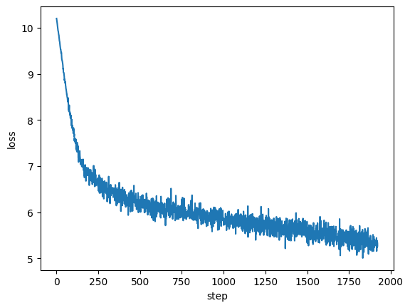

## 0 Masking After Softmax Implementation Evaluation

### Training Steps vs. Loss

### Evaluation

- **notice the long tail of PAD tokens:**  
   `[0, 7441, 64, 98, 149, 2, 9, 2697, 15, 72, 168, 171, 20, 46, 236, 1, 3, 3, 3, 3, 3, 3, 3, 3, 3, 3, 3, 3, 3, 3, 3, 3, 3, 3, 3, 3, 3, 3, 3, 3, 3, 3, 3, 3, 3, 3, 3, 3, 3, 3, 3, 3, 3, 3, 3, 3, 3, 3, 3, 3, 3, 3, 3, 3, 3, 3, 3, 3, 3, 3, 3, 3, 3, 3, 3, 3, 3, 3, 3, 3, 3, 3, 3, 3, 3, 3, 3, 3, 3, 3, 3, 3, 3, 3, 3, 3, 3, 3, 3, 3]`

- **reported loss from model:** `4.913432598114014`
- **manually calculated loss:** `4.913431167602539`
- **manually calculated loss again:** `4.913430690765381`
- **perplexity:** `136.10562133789062`
---
- **loss1:** 8.430329322814941
**perplexity1:** 4584.0094633127255

- **loss2:** 5.465612411499023
**perplexity2:** 236.42059747589227

- **loss3:** 6.270555019378662
**perplexity3:** 528.7707744764614

- **loss4:** 4.994579315185547
**perplexity4:** 147.61083468327456

---
- **train perplexity:** 200.31643631305718
- **dev perplexity:** 186.5421279009921
---
- <START> <UNK> .  <STOP>

- <START> And over " " " "  <STOP>

- <START> dramatic " " has by " " which could " <STOP>
- <START>  A " <STOP>
- <START> After " " " " " said " I " " " " he I " " will I " " " " " " She 't " not " <STOP>
- <START> " <UNK> Berlusconi <STOP>
- <START> <UNK> each service at 2009 . <STOP>
- <START> I said all <STOP>
- <START>Mark " the " " "  <STOP>
- <START> " 'd " I I " <STOP>